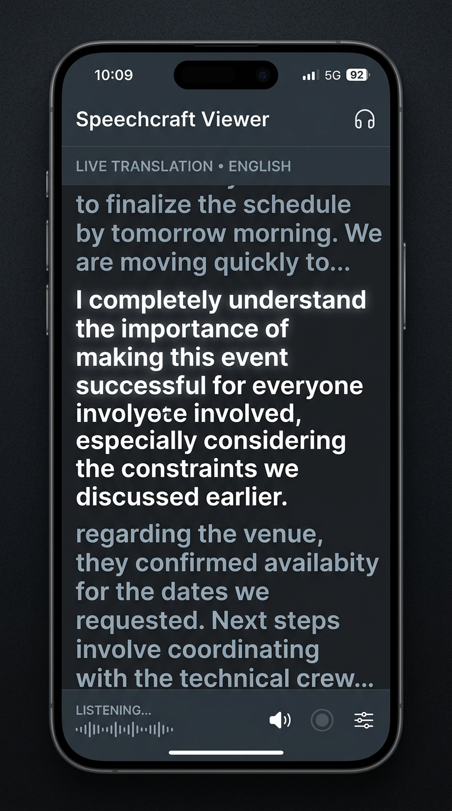
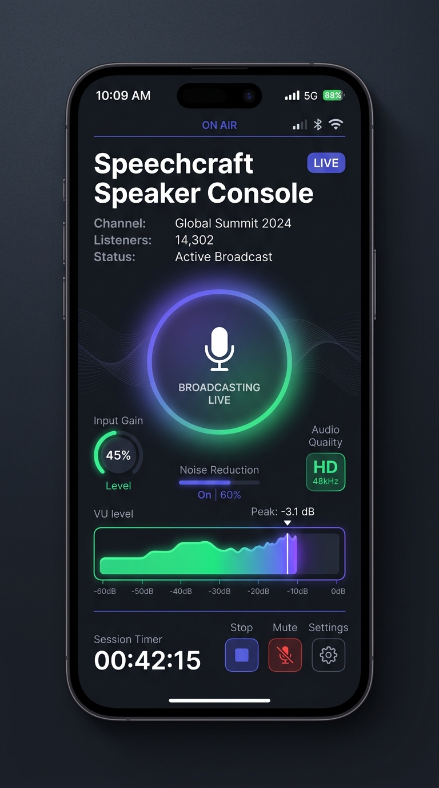
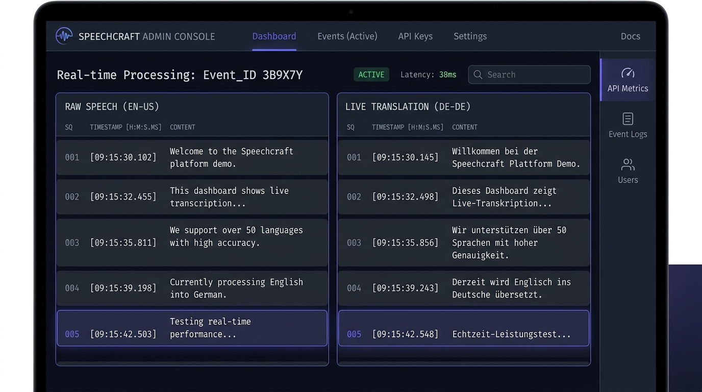
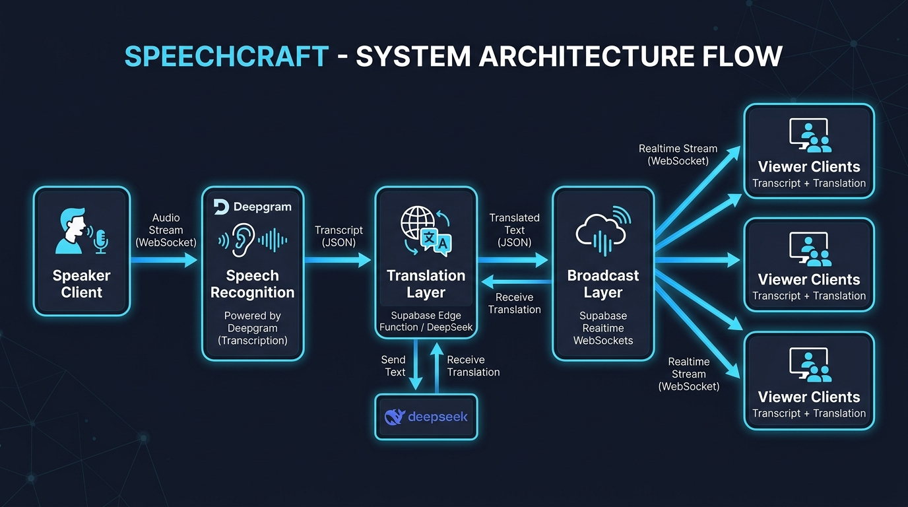

# Speechcraft

### *Real-time AI interpretation for live events.*

**Speak naturally in Indonesian and instantly broadcast English translations to attendees on their phones.**

Speechcraft is a real-time AI interpretation platform that converts spoken Indonesian into live English translations and broadcasts them instantly to attendees through a web browser.

---

## 🚀 Why Speechcraft Exists

Many organizations (churches, seminars, local non-profits) serve multilingual audiences but cannot afford professional translation equipment or dedicated interpreters. 

Speechcraft provides a lightweight, zero-maintenance alternative using only a speaker's phone, attendee web browsers, and serverless AI. The system is optimized for low latency, zero monthly infrastructure cost, and friction-free audience access.

*   **No native apps** to install.
*   **No user accounts** or registration required.
*   **No database storage** or persistent transcripts.

---

## 📷 Gallery & Interfaces

### 📱 1. Viewer Experience
Attendees open a URL or scan a QR code to read live scrolling translations on their device. A headphones toggle activates text-to-speech synthesis so they can listen in English.

<p align="center">
  
</p>

### 🎙️ 2. Speaker Console
The presenter logs in with a secure session PIN, selects their translation options, and begins speaking. The console visualizes live audio capture levels and utilizes browser screen wake locks to prevent the OS from sleeping.

<p align="center">
  
</p>

### 🖥️ 3. Developer Debug Dashboard
A developer dashboard displaying raw ASR inputs, processed translation segments, sequence numbers, and latency logs side-by-side.

<p align="center">
  
</p>

---

## 🛠️ Tech Stack

*   **Frontend**: Next.js 15, TypeScript, TailwindCSS, Progressive Web App (PWA)
*   **Backend**: Supabase serverless Edge Functions (Deno DBR), Supabase Realtime (WebSockets)
*   **AI Integrations**: Deepgram Nova-2 ASR, DeepSeek V4-Flash Translation
*   **Hosting**: Vercel Free Tier, Supabase Cloud Free Tier

---

## 🧭 System Architecture Flow

Speechcraft offloads speech recognition client-side to minimize server load. It uses a serverless proxy to protect API secrets and inject context before broadcasting the results to audience devices:



---

## 📈 Performance & Latency Profiles

Measured voice-to-screen performance is optimized for near-instant conversational pacing:

| Stage | Action / Component | Typical Latency | Notes |
|---|---|---|---|
| **1** | Speech Recognition (ASR) | **300–800 ms** | Downsampled audio blocks streamed to Deepgram WebSockets. |
| **2** | Contextual Translation Proxy | **200–500 ms** | Deno Edge Function prompt construction and DeepSeek chat completion. |
| **3** | Realtime Sync Broadcast | **<100 ms** | Ephemeral WebSocket push to all connected viewers. |
| **Total** | **End-to-End Latency** | **~1.1 seconds** | Immediate, scrolling English translations on listener screens. |

---

## 🧠 Engineering Challenges Solved

Building Speechcraft as a high-fidelity system on free serverless resources required solving several core engineering challenges:

*   **Low-Latency Translation Pipeline**: By using client-side downsampling (Web Audio API) and streaming directly to Deepgram WebSockets, Speechcraft avoids raw audio processing overhead on server runtimes.
*   **Stateless Architecture**: By using Supabase Realtime channels to propagate translation segments, we broadcast events ephemerally, completely skipping database writes and avoiding storage limits.
*   **Translation Context Preservation**: Rather than translating isolated sentences, Speechcraft maintains a sliding window of the last 3 translation segments to preserve pronouns, past tenses, and context-specific names.
*   **API Secret Shielding**: Temporary single-use token generation for Deepgram prevents exposure of permanent API keys in frontend code.
*   **Browser Keep-Alive**: Programmatic use of the Screen Wake Lock API prevents mobile devices from sleeping during long recording sessions.
*   **Phonetic Error Correction**: Injected a structured system prompt glossary to resolve phonetic speech errors (e.g. mapping `tuan` to `Lord`).

---

## 🏎️ Quick Start

### 1. Install dependencies
```bash
pnpm install
```

### 2. Configure local environment variables
Create `packages/frontend/.env.local`:
```env
NEXT_PUBLIC_SUPABASE_URL=http://localhost:54321
NEXT_PUBLIC_SUPABASE_ANON_KEY=your-anon-key
```

Create `supabase/.env.local`:
```env
DEEPSEEK_API_KEY=your-key
ADMIN_PIN_HASH=0f7d0f6b15be5f7a0df98ca3de2c30d5fef1ebd8c06bcdfef6dd629591461789
```

### 3. Run development stack
```bash
pnpm dev
```

For comprehensive instructions on production setups, refer to the **[Deployment Guide](file:///home/ltanaka/github/translation-service/docs/deployment.md)**.

---

## 📚 Technical Documentation

Explore detailed guides on each system component:

*   **[Overview Specification](file:///home/ltanaka/github/translation-service/docs/overview.md)**: Product mission, target personas, and scope details.
*   **[System Architecture](file:///home/ltanaka/github/translation-service/docs/architecture.md)**: Full component layouts, diagrams, and block responsibilities.
*   **[Translation Pipeline](file:///home/ltanaka/github/translation-service/docs/translation-pipeline.md)**: Context window mapping, DeepSeek integration details, and glossary settings.
*   **[Deployment Guide](file:///home/ltanaka/github/translation-service/docs/deployment.md)**: Serverless configuration, secrets management, and environment variables.
*   **[Security & Privacy](file:///home/ltanaka/github/translation-service/docs/security.md)**: Brute-force protections, rate limiting, and client authentication tokens.
*   **[User Journeys](file:///home/ltanaka/github/translation-service/docs/user-journeys.md)**: Detailed step-by-step user paths for Speakers, Viewers, and Administrators.
*   **[System Performance](file:///home/ltanaka/github/translation-service/docs/performance.md)**: Reconnect behaviours, failover conditions, and network benchmarks.
*   **[Translation Glossary](file:///home/ltanaka/github/translation-service/docs/glossary.md)**: Detailed Indonesian-to-English glossary settings.
*   **[Project Roadmap](file:///home/ltanaka/github/translation-service/docs/roadmap.md)**: Future ideas, multi-language planning, and analytical milestones.
