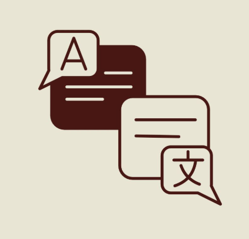

# Speechcraft Design Language

This document defines the visual identity, color system, typography, component patterns, and design principles for the Speechcraft platform. Use this as the baseline reference for all UI decisions.

---

## 🎨 Brand Identity

### Logo Mark

<p align="center">
  
</p>

The Speechcraft logo depicts two overlapping speech bubbles — one dark (source language) and one light (target language) — symbolizing real-time cross-language communication. Small speech tags labeled "A" and "文" represent the Latin and CJK script families, reinforcing the translation concept.

### Brand Attributes

| Attribute | Value |
|---|---|
| **Personality** | Professional, calm, trustworthy, accessible |
| **Mood** | Quiet confidence — the UI should feel like a tool that fades into the background while the translated words take center stage |
| **Metaphor** | A bridge between languages — not flashy, but reliable and always there |

---

## 🎨 Color System

### Brand Palette (from logo)

| Swatch | Name | Hex | Usage |
|---|---|---|---|
| 🟫 | **Maroon** | `#3C1518` | Logo strokes, brand accent in light contexts |
| 🟤 | **Burgundy** | `#4A1A1D` | Logo fill, deep accent |
| 🟡 | **Warm Cream** | `#E8E0D4` | Logo background, light-mode surfaces |
| ⬜ | **Off-White** | `#F5F0EA` | Light bubble fill, light-mode cards |

### Application Color Tokens

All colors below are defined as CSS custom properties in [`globals.css`](../packages/frontend/src/app/globals.css).

#### Surface (Warm Light Theme — Default)

| Token | Hex | Purpose |
|---|---|---|
| `--color-surface-primary` | `#E8E0D4` | Page background (warm cream) |
| `--color-surface-secondary` | `#F5F0EA` | Card backgrounds, panels (off-white) |
| `--color-surface-tertiary` | `#E1D6C7` | Elevated surfaces, hover states |
| `--color-surface-border` | `#C5B49F` | Dividers, card borders |
| `--color-surface-muted` | `#D8CAB6` | Disabled backgrounds, subtle fills |

#### Text

| Token | Hex | Purpose |
|---|---|---|
| `--color-text-primary` | `#3C1518` | Headings, body copy (maroon) |
| `--color-text-secondary` | `#5E272B` | Labels, captions, metadata (burgundy) |
| `--color-text-muted` | `#6B594B` | Disabled text, timestamps (warm gray/taupe) |

#### Accent (Wine)

| Token | Hex | Purpose |
|---|---|---|
| `--color-accent` | `#A3424A` | Primary interactive elements (wine red) |
| `--color-accent-hover` | `#C25560` | Hover state |
| `--color-accent-strong` | `#8B2D35` | Filled buttons, strong CTA |
| `--color-accent-deep` | `#6B1D24` | Pressed/active state |
| `--color-accent-muted` | `#7A2830` | Focus rings, subtle accent |

#### Status

| Token | Hex | Purpose |
|---|---|---|
| `--color-status-live` | `#15803d` | Live/active broadcast indicator (green-700) |
| `--color-status-live-bright` | `#22c55e` | Pulsing live dot glow (green-500) |
| `--color-status-error` | `#b91c1c` | Error states, failed auth (red-700) |
| `--color-status-error-bright` | `#ef4444` | Error text highlights (red-500) |
| `--color-status-error-dark` | `#7f1d1d` | Error card backgrounds (red-900) |

---

## 🔤 Typography

### Font Stack

```css
font-family: var(--font-geist-sans), Arial, Helvetica, sans-serif;
```

Geist Sans loaded via `next/font` for high-quality modern typeface with system sans-serif fallback for offline/low-bandwidth situations.

### Type Scale

| Element | Size | Weight | Token/Usage |
|---|---|---|---|
| Page title | `text-2xl` | Bold | Speaker console title, viewer header |
| Section heading | `text-lg` | Semibold | Card titles, drawer headers |
| Body / Translation text | `text-base` → `text-4xl` | Bold | Viewer teleprompter (user-adjustable) |
| Label | `text-xs` | Medium | Status labels, metadata, timestamps |
| Caption / Muted | `text-xs` | Normal | Sequence numbers, technical info |

### Viewer Font Size Control

Viewers can dynamically scale translation text using `A-` / `A+` buttons. Four levels defined:

| Level | Class | Approx Size |
|---|---|---|
| Small | `text-xl` | 20px |
| Medium (default) | `text-2xl` | 24px |
| Large | `text-3xl` | 30px |
| Extra Large | `text-4xl` | 36px |

---

## 📐 Spacing & Layout

### Border Radius Scale

| Token | Value | Usage |
|---|---|---|
| `--radius-sm` | `0.375rem` (6px) | Small chips, badges |
| `--radius-md` | `0.5rem` (8px) | Input fields |
| `--radius-lg` | `0.75rem` (12px) | Cards, buttons |
| `--radius-xl` | `1rem` (16px) | Large buttons, panels |
| `--radius-2xl` | `1.5rem` (24px) | Modals, drawers |
| `--radius-full` | `9999px` | Status dots, circular indicators |

### Touch Targets

All interactive elements enforce a minimum height of `48px` (`min-h-[48px]`) per WCAG 2.5.5 Target Size guidelines. Critical for mobile-first church attendees using the viewer on phones.

---

## 🧩 Component Library

### Button

Three variants, three sizes. All have `active:scale-[0.98]` micro-press feedback.

| Variant | Appearance | Use Case |
|---|---|---|
| `primary` | Indigo filled, white text, shadow glow | Start/stop broadcast, confirm actions |
| `secondary` | Slate filled, border, muted text | Settings, secondary actions |
| `ghost` | Transparent, text only | Inline toggles, icon buttons |

| Size | Padding | Radius |
|---|---|---|
| `sm` | `px-2 py-1` | `rounded-lg` |
| `md` | `px-4 py-2` | `rounded-lg` |
| `lg` | `px-6 py-3` | `rounded-xl` |

Supports `iconLeft`, `iconRight`, and icon-only mode (auto-detected when no `children`).

### Card

Container component with three semantic variants:

| Variant | Background | Border | Use Case |
|---|---|---|---|
| `default` | `surface-secondary/80` | `surface-border/50` | General content containers |
| `accent` | `accent/10` | `accent/20` | Highlighted info, active states |
| `error` | `status-error-dark/50` | `status-error` | Error messages, failed states |

### StatusDot

Live indicator with three states:

| State | Color | Effect | Meaning |
|---|---|---|---|
| `live` | Green (`#22c55e`) | `animate-pulse` + green glow shadow | Broadcasting active |
| `idle` | Slate muted | None | Standby |
| `error` | Red (`#ef4444`) | None | Connection lost |

### PinGate

Authentication wrapper used on `/speaker` and `/admin`. Renders a numeric PIN input, error display with lockout countdown, and "Remember me" checkbox. Clears credentials from `sessionStorage` on lock.

---

## ✨ Motion & Animation

### Keyframes

| Animation | Duration | Easing | Purpose |
|---|---|---|---|
| `fadeInUp` | 300ms | `ease-out` | New translation segments appearing |
| `wave-1` through `wave-5` | 0.9s–1.5s | `ease-in-out infinite` | Audio VU meter bars (speaker console) |
| `pulse-ring` | 2s | `cubic-bezier(0.4, 0, 0.6, 1) infinite` | Broadcasting status ring glow |

### Interaction Feedback

| Interaction | Effect |
|---|---|
| Button press | `active:scale-[0.98]` — subtle press-down |
| Hover (buttons) | Color shift via `hover:` variant tokens |
| Focus visible | `outline-2 outline-offset-2 outline-accent` |
| State transitions | `transition-all duration-200` on all interactive elements |

### Teleprompter Scrolling

Translation segments use a fade-hierarchy visual model:
- **Current segment**: Full opacity (`text-primary`), bold, largest
- **Previous segments**: Reduced opacity, faded upward
- **Oldest segments**: Near-transparent, eventually removed from DOM (max 3 retained)

---

## 📱 Responsive & Platform Guidelines

### Mobile-First

All layouts target **portrait mobile** as primary viewport. The viewer page is designed to be used by church attendees holding phones vertically.

### Platform-Specific Behaviors

| Feature | Implementation |
|---|---|
| **Screen Wake Lock** | `navigator.wakeLock.request('screen')` — prevents sleep during broadcast |
| **PWA** | Speaker console installable as home-screen app |
| **Audio Worklet** | Custom `AudioWorkletProcessor` for 16kHz downsampling |
| **Web Speech Synthesis** | Browser-native TTS for headphones mode (viewer) |

### Minimum Viewport

| Surface | Min Width | Notes |
|---|---|---|
| Viewer | 320px | iPhone SE smallest target |
| Speaker | 360px | Assumes modern smartphone |
| Admin | 768px | Debug console benefits from wider viewport |

---

## ♿ Accessibility

| Requirement | Implementation |
|---|---|
| Touch targets | Min 48px height on all buttons |
| Color contrast | WCAG AA/AAA — high contrast maroon text on light cream surfaces |
| Focus indicators | Visible outline ring on keyboard focus (`focus-visible:outline-accent`) |
| Screen reader | `aria-label` on status dots, semantic HTML structure |
| Font scaling | User-controlled A-/A+ font size adjustment (viewer) |

---

## 📝 Usage Notes

- **Warm light theme is default** — matches the warm Speechcraft visual identity (`image.png`) for high readability and warmth during services
- **Wine/maroon accent** chosen for brand alignment and strong visual hierarchy
- **No decorative imagery** in the UI — translation text is the hero content. Everything else supports readability
- **Status colors are semantic** — green = live, red = error. No ambiguous color usage
- **All tokens are centralized** in `globals.css` — components reference tokens, never hardcoded hex values
